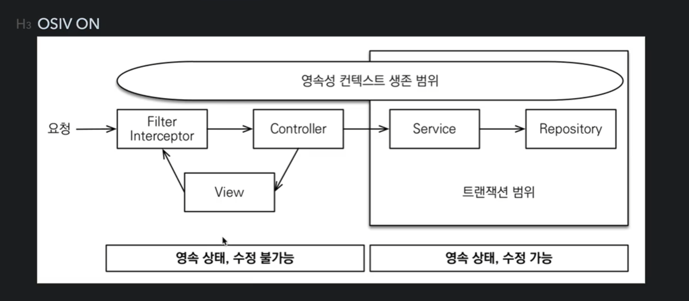
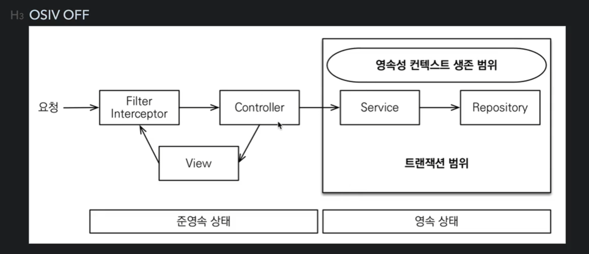

+ ### Spring Boot Thymeleaf
  + 스프링 부트 thymeleaf viewName 매핑
    + > resources:templates/{ViewName}.html

+ ### H2 데이터베이스
  + 개발이나 테스트 용도로 가볍고 편리한 DB, 웹 하면 제공
  + 링크 : https://www.h2database.com
  + 데이터베이스 파일 생성 방법
    + http://localhost:8082 접속
      + jdbc:h2:~/spring-data-jpa-test (초기 파일 생성용)
    + <U>**~/spring-data-jpa-test**</U> 파일 생성 확인
      + windows : <U>**C:\Users\user**</U>
      + mac : 정리 예정
    + 이후 부터는 <U>**jdbc:h2:tcp://localhost/~/spring-data-jpa-test**</U> 로 접속

+ ### API
  + API를 만들 때 파라미터와 return 값을 Entity로 사용해선 안된다.
    + Entity 값이 변경되면 운영 이슈가 터지가 떄문.
    + Entitu 안의 연관관계가 매핑되어있는 불필요한 값도 노출이 된다.

+ ### Spring-Data-Jpa
  + Repository 생성시 JpaRepository<T, ID> 을 상속받는다.
    + 지원 메서드 :
      + findAll
      + findById
      + save
      + 등등

+ ### 쿼리 방식 선택 권장 순서
  1. 우선 엔티티를 DTO로 변환하는 방법을 선택한다.
  2. 필요하면 fetch join으로 성능을 최적화 한다 . -> 대부분의 성능 이슈가 해결된다.
  3. 그래도 안되면 DTO로 직접 조회하는 방법을 선택한다.
  4. 최후의 방법은 JPA가 제공하는 네이티브 SQL이나 스프링 JDBC Template을 사용하서 SQL을 직접 사용한다.    

+ ### 페이징
  + @ManyToOne, @OneToOne은 fetch join 사용
  + @OneToMany, @ManyToMany는 <U>**default-batch-fetch-size**</U> 사용 후 따로 조회한다.

+ ### OSIV
  + Open Session In View - True 전략
  + 
    + spring:
      + jpa:
        + open:
          + in:
            + view: true 
  + <U>**위와 같이 true 값이 기본값이다.**</U> (yml 설정)
  + 이 기본값을 뿌리면서 애플리케이션 시작 시전에 warn 로그를 남기는 것은 이유가 있다.
  + 설명 : 
    + OSIV 전략은 트랜잭션 시작처럼 최초 데이터베이스 커넥션 시작 시점부터  
      API 응답이 끝날 때 까지 영속성 컨텍스트와 데이터베이스 커넥션을 유지한다.  
      그래서 지금까지 View Template이나 API 컨트롤러에서 지연로딩이 가능했던 것이다  
      지연 로딩은 영속성 컨텍스트가 살아있어야 가능하고,  
      영속성 컨텍스트는 기본적으로 데이터베이스 커넥션을 유지한다. 이것 자체가 큰 장점이다.  
      그런데 이 전략은 너무 오랜시간동안 데이터베이스 커넥션 리소스를 사용하기 때문에, 실시간 트래픽이 중요한  
      애플리케이션에서는 커넥션이 모자랄 수 있다. 이것은 결국 장애로 이어진다.  
      예를 들어서 컨트롤러에서 외부 API를 호출하면 외부 API 대기 시간 만큼 커넥션 리소스를 반환하지 못하고 유지해야한다.
     
  + Open Session In View - False 전략
  + 
  + spring:
    + jpa:
      + open:
        + in:
          + view: false
  + <U>**영속성 컨텍스트의 범위가 트랜잭션 범위로 한정된다.**</U>
  + 설명 :
    + OSIV를 끄면 트랜잭션을 종료할 때 영속성 컨텍스트를 닫고, 데이터베이스 커넥션도 반환한다.  
      따라서 커넥션 리소스를 낭비하지 않는다.  
      OSIV를 끄면 모든 지연로딩을 트랜잭션 안에서 처리해야 한다.  
      따라서 지금까지 작성한 많은 지연로딩 코드를 트랜잭션 안으로 넣어야 하는 단점이 있다.
      그리고 view template에서 지연로딩이 동작하지 않는다.  
      결론적으로 트랜잭션이 끝나기 전에 지연 로딩을 강제로 호출해 두어야 한다.
    
  + 참고 : 
    + 고객서비스의 실시간 API는 OSIV를 끄고, ADMIN 처럼 커넥션을 많이 사용하지 않는 곳에서는 OSIV를 켜는 방법도 있다.
    + 예)
      + OrderService
        + OrderService : 핵심 비즈니스 로직
        + OrderQueryService : 화면이나 API에 맞춘 서비스 (주로 읽기 전용 트랜잭션 사용)  